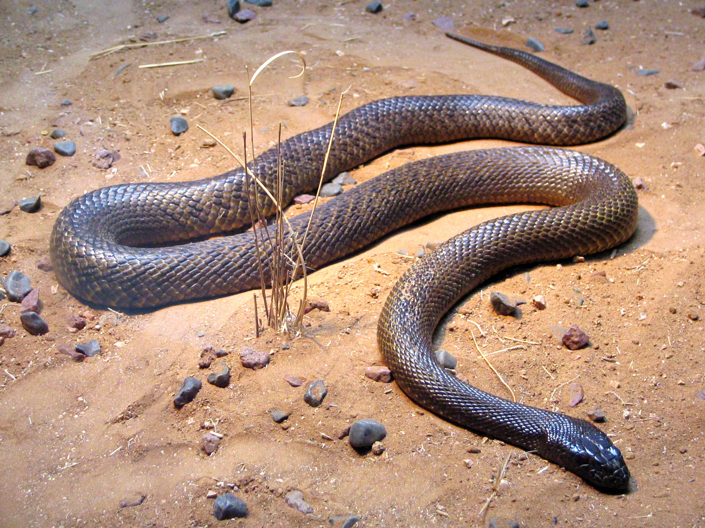

# Overview

The Inland Taipan, scientifically known as Oxyuranus microlepidotus, is a highly venomous snake endemic to the arid regions of central Australia. It is widely recognized as the most venomous land snake in the world, possessing a venom potency that far surpasses that of any other snake. Despite its venomous nature, the Inland Taipan is relatively shy and elusive, often avoiding human encounters due to its remote habitat.

# Anatomy

The Inland Taipan has a slender and streamlined body, which aids in its rapid movement across the sandy and rocky terrains it inhabits. It averages a length of around 1.8 meters (6 feet), with some individuals reaching up to 2.5 meters (8 feet). The snake's coloration varies from light brown to a dull olive or dark tan, allowing it to blend in with its arid surroundings.

This snake possesses a small, flattened head, distinct from its body, which aids in burrowing through the sandy substrate. It has a pair of long, hollow fangs in the front of its mouth, through which it delivers a potent venom to immobilize its prey or defend itself from threats.

# Diet

The Inland Taipan primarily preys upon small mammals, particularly rodents such as rats and mice. It also feeds on lizards and small birds when the opportunity arises. The snake is an adept hunter, employing a sit-and-wait strategy or actively searching for prey in its habitat.

When the Inland Taipan captures its prey, it delivers a series of rapid and precise strikes, injecting highly potent venom. The venom is a potent neurotoxin that causes paralysis and disrupts the prey's cardiovascular system. This enables the snake to immobilize and consume its prey without risking injury.

# Habitat

The Inland Taipan is found in the arid and semi-arid regions of central Australia, including parts of Queensland, South Australia, and the Northern Territory. It inhabits a variety of landscapes, including grasslands, shrublands, and desert plains. The snake prefers areas with loose, sandy soils, as it facilitates burrowing and constructing its underground shelters.

Due to its secretive nature, the Inland Taipan spends most of its time hidden underground in self-dug burrows or abandoned animal burrows. These burrows provide protection from extreme temperatures and predators, allowing the snake to regulate its body temperature and remain relatively safe. The snake is primarily active during the day, seeking prey or basking in the sun to warm itself.

# Credit

Wikipedia contributors, "Inland taipan," Wikipedia, The Free Encyclopedia, <https://en.wikipedia.org/w/index.php?title=Inland_taipan&oldid=1159924486> (accessed June 26, 2023).
