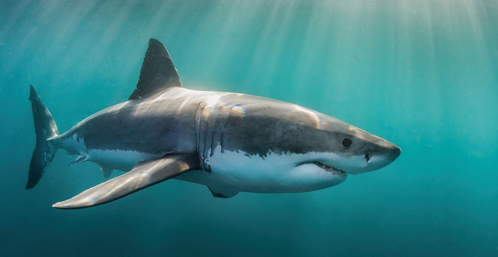

# Overview

The Great White Shark, scientifically known as Carcharodon carcharias, is a large predatory fish that is widely recognized as one of the most fearsome and awe-inspiring creatures in the ocean. It is often referred to as the "great white" due to its distinctive white belly. With its powerful build and serrated, triangular teeth, this apex predator has fascinated researchers, divers, and the general public for centuries.

For reference, below is a table, showing the distribution of shark attacks globally:

<table>
  <tr>
    <th colspan="4">Shark Attack Activity (2004-2013)</th>
  </tr>
  <tr>
    <th>Year</th>
    <th>Total Attacks</th>
    <th>Fatal</th>
    <th>Non-Fatal</th>
  </tr>
  <tr>
    <td>2004</td>
    <td>66</td>
    <td>7</td>
    <td>59</td>
  </tr>
  <tr>
    <td>2005</td>
    <td>58</td>
    <td>4</td>
    <td>54</td>
  </tr>
  <tr>
    <td>2006</td>
    <td>59</td>
    <td>4</td>
    <td>55</td>
  </tr>
  <tr>
    <td>2007</td>
    <td>71</td>
    <td>1</td>
    <td>70</td>
  </tr>
  <tr>
    <td>2008</td>
    <td>53</td>
    <td>4</td>
    <td>49</td>
  </tr>
  <tr>
    <td>2009</td>
    <td>68</td>
    <td>7</td>
    <td>61</td>
  </tr>
  <tr>
    <td>2010</td>
    <td>82</td>
    <td>6</td>
    <td>76</td>
  </tr>
  <tr>
    <td>2011</td>
    <td>79</td>
    <td>13</td>
    <td>66</td>
  </tr>
  <tr>
    <td>2012</td>
    <td>81</td>
    <td>7</td>
    <td>74</td>
  </tr>
  <tr>
    <td>2013</td>
    <td>72</td>
    <td>10</td>
    <td>62</td>
  </tr>
</table>

# Anatomy

Great white sharks have a robust and streamlined body that allows them to swim at high speeds and maneuver with precision. They can reach an average length of 4.6 to 6.1 meters (15 to 20 feet), although some individuals have been recorded measuring over 7 meters (23 feet). These sharks have a grayish-blue dorsal side that helps them blend in with the ocean depths when viewed from above.

One of the most striking features of the great white shark is its mouth, which is filled with rows of sharp, serrated teeth. They have around 300 teeth in multiple rows, and when a tooth becomes worn or lost during hunting, it is quickly replaced by a new one from behind. Their teeth are specifically adapted for gripping and tearing prey.

# Diet

As apex predators, great white sharks have a diverse diet that primarily consists of marine mammals, such as seals, sea lions, and smaller cetaceans. They are known for their remarkable hunting technique called "breaching," where they launch themselves out of the water to surprise their prey from below. This behavior is often observed when targeting seals near the ocean's surface.

While marine mammals make up a significant part of their diet, great white sharks are opportunistic feeders and will also consume fish, squid, and even seabirds. They are known for their powerful bite force, which can exert tremendous pressure when capturing and consuming prey.

# Habitat

Great white sharks have a wide distribution, inhabiting coastal and offshore waters in various parts of the world. They are commonly found in temperate and tropical regions, such as the coasts of South Africa, Australia, California, and the Mediterranean Sea.

These sharks are known to undertake long-distance migrations, traveling across vast oceanic areas. They often follow marine mammal migration patterns or move to areas abundant with prey. Great white sharks are typically found in the upper part of the ocean, but they can also dive to considerable depths, reaching over 1,200 meters (3,900 feet).

It's important to note that great white sharks are protected species in many countries due to their vulnerable population status. Conservation efforts and research play a crucial role in understanding and protecting these magnificent creatures.